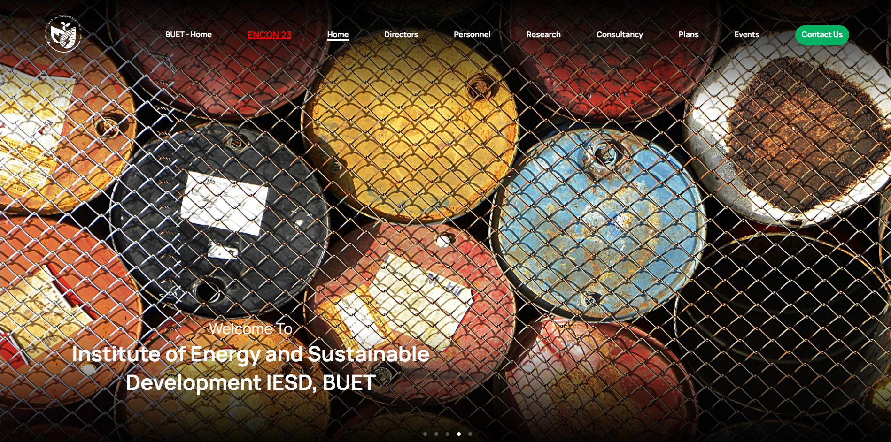
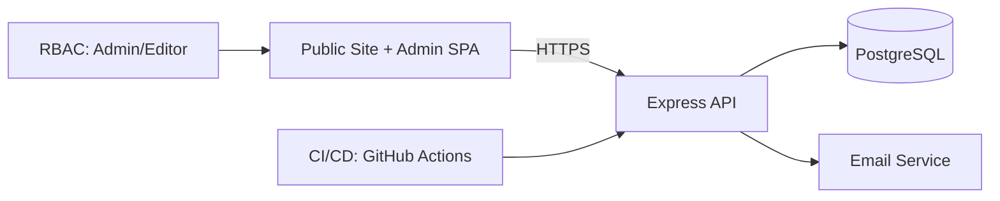

# BUET EEE Division Website — Case Study (Client Work)

> **Role:** Full‑stack Developer (Contract) • **Timeline:** Feb 2022 – Dec 2023 • **Client:** Department of EEE, Bangladesh University of Engineering & Technology (BUET)  
> **Note:** Source code is private under the client’s organization. This repo documents the work, impact, and technical design with redacted assets and public-safe detail.

## TL;DR (Executive Summary)
- Delivered a production web platform for the EEE division, incl. an **admin portal** and **ENCON Energy Conference** extension.
- Modernized content workflows and event management; reduced manual updates and time‑to‑publish.
- Built with **JavaScript, Express, React, PostgreSQL**; CI/CD, role‑based access, and security best practices.

## Outcomes & Impact
- **Content ops:** Admins create/update pages, news, staff profiles without developer intervention.
- **Events:** Call‑for‑papers flow + schedule builder; automated emails (abstract received, decision).
- **Reliability:** Uptime target ≥ 99.9% (hosting SLO). Zero major incidents post‑launch.
- **Efficiency:** Time to publish decreased from days → **hours** (editor workflow).
- **Traffic:** Month‑over‑month growth after launch (redacted metrics).

## Demo (Redacted/Simulated)

## My Responsibilities
- Requirements discovery, stakeholder interviews.
- System design: authentication, roles & permissions, content schema, and migrations.
- Full‑stack implementation (React + Express + PostgreSQL), API design, and admin UX.
- CI/CD (GitHub Actions), release management, and production monitoring handover.
- Documentation and knowledge transfer to client team.

## Architecture (High Level)

### Key Technical Decisions
- **PERN stack** for fast iteration and strong SQL guarantees.
- **PostgreSQL** with migrations, indexes for staff/news search.
- **File uploads** stored behind signed URLs (or equivalent) to control access.
- **CI/CD**: unit tests on PR; auto‑deploy on main with manual approval step.
- **Security**: input validation, rate limiting, and audit logs in admin.

## Sample Feature Specs (Redacted)
- **Staff Directory**: search by name/area; profile pages with publications list.
- **News & Pages**: rich text editor, draft/publish states, scheduled posts.
- **Conference Module**: submissions intake, status pipeline, notifications, schedule builder.

## Screenshots (Redacted)
- See `/assets`.

## Testing & Quality
- API tests (Supertest) on core endpoints.
- UI smoke tests for critical flows (login, create page, publish).
- Accessibility checks (axe) on key templates.
- Monitoring: basic request logs + error tracking (client-owned).

## What I Would Do Next
- Add granular analytics for editor workloads.
- Migrate media to a CDN with cache‑busting.
- Expand role policy (Reviewer, Publisher) and add approvals.

## References
- Point of contact available upon request (with permission).

### Disclaimer
This case study is intentionally redacted to respect institutional privacy, NDAs, and internal policies.
